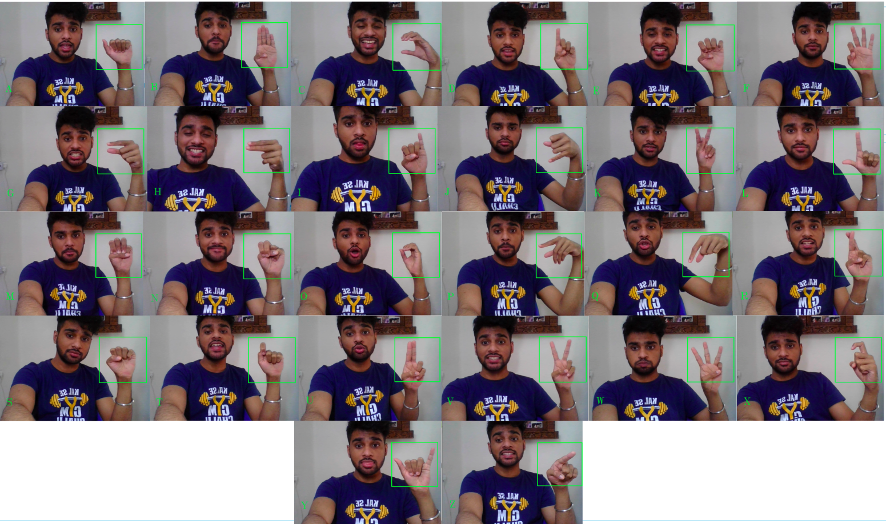

 <p align = "center">         

</p>
<h1 align="center"> American-Sign-Language-Recognition </h1>
<p align = "center">
  CNN model to recognise which letter of the <i> American Sign Language </i> (ASL) alphabet is being signed.
</p>

---

<details open="open">
  <summary >Table of Contents</summary>
  <ol>
    <li>
      <a href="#about-the-project">About The Project</a>
      <ul>
        <li><a href="#built-with">Built With</a></li>
      </ul>
    </li>
    <li>
      <a href="#getting-started">Getting Started</a>
      <ul>
        <li><a href="#installation">Installation</a></li>
        <li><a href="#running-this-project">Running this project</a></li>
      </ul>
    </li>
    <li><a href="#demonstraions">Demonstrations</a></li>
    <li><a href="#contributers">Contributers</a></li>
  </ol>
</details>

## About The Project
 
Our project aims at taking the basic step in bridging the communication gap between normal people and deaf people using sign language by building a possible sign language translator, which can take communications in sign language and translate them into written language.

### Built With
* [Tenserflow](https://www.tensorflow.org/)
* [Keras](https://keras.io/)
* [OpenCV](https://opencv.org/)
* [Numpy](https://numpy.org/)
## Getting Started

To get a local copy up and running follow these simple example steps.

### Installation

1. Clone the repo
   ```sh
   git clone https://github.com/sanya911/American-Sign-Language-Recognition.git
   ```
### Running this project

To get a local copy up and running follow these simple example steps.
1. Install Python 3, Opencv 3, Tensorflow, Keras.
2. To train the model.
    ```
    python cnn_model.py
    ```
2. Now to test the model you just need to run recognise.py . To do so open the terminal and run following command.
    ```
    python ASLR.py
    ```
 ## Demonstrations

  
 
## Contributers
* **Shravan Rajesh**
* **Sanya Agrawal**


